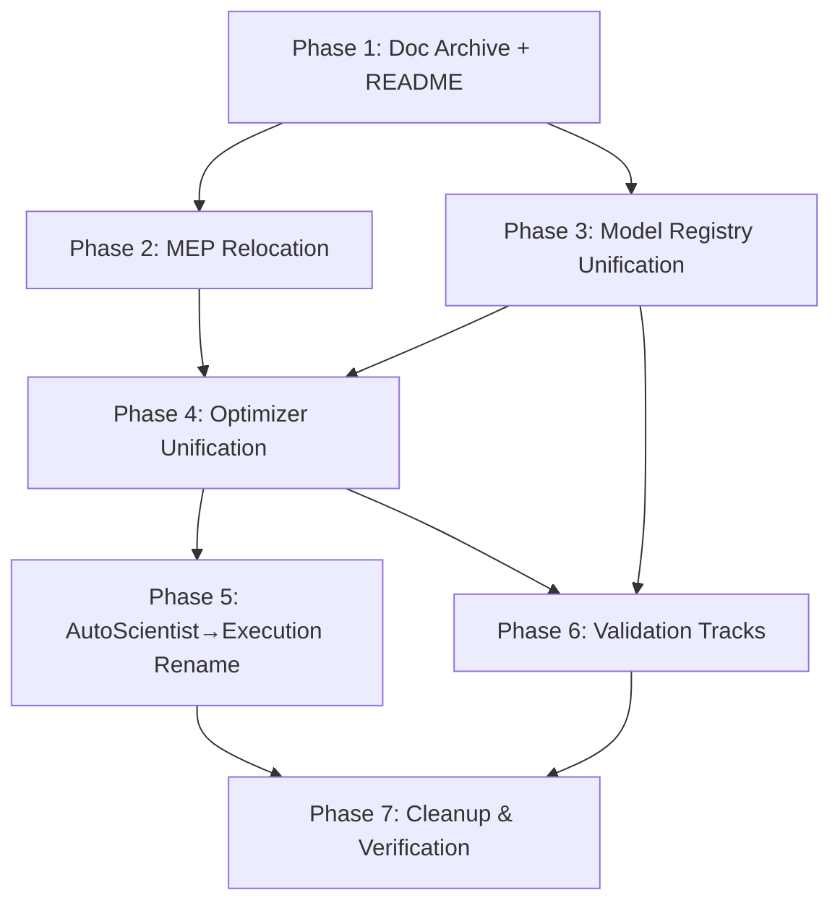

# REFACTOR.md — Bioplausible Codebase Reorganization Plan

## Executive Summary

This plan addresses four interconnected problems:

1. **Documentation fragmentation**: 50+ `.md` files in `/docs/` + multiple READMEs; no single source of truth
2. **Organizational inconsistency**: `mep/` is a top-level package but logically belongs under the algorithms zoo
3. **Functional redundancy**: Three optimizer systems, two model registries, two AutoScientist systems
4. **Naming/identity confusion**: "Zoo" vs "Models" vs "Optimizers" vs "Learning Rules" vs "Propagators"

**Goal**: Single authoritative `README.md` as index; all components discoverable from it; minimal, non-redundant codebase.

---

## 1. Documentation Consolidation

### 1.1 Archive Non-README Documentation

**Action**: Move all `/docs/*.md` + `README0.md` + `mep/README*.md` + `mep/docs/*.md` + root `*.md` (except `README.md`, `AGENTS.md`, `CONTRIBUTING.md`, `LICENSE`, `CHANGELOG.md`) → `/docs/archive/YYYYMMDD/`

**Keep at root**:
- `README.md` ← **Single source of truth, expanded per §1.2**
- `AGENTS.md` ← Agent instructions (this file's counterpart)
- `CONTRIBUTING.md` ← Contribution guidelines
- `CHANGELOG.md` ← Version history
- `LICENSE` ← License

**Archive destination**: `docs/archive/20260722/` (timestamped for traceability)

### 1.2 README.md Expansion Plan

**Current state**: ~400 lines, good high-level structure but incomplete coverage.

**Target structure** (each section links to *one* canonical source file):

| Section | Canonical Source File(s) | Notes |
|---------|-------------------------|-------|
| **Installation** | `pyproject.toml`, `mep/pyproject.toml` | Keep minimal; link to `INSTALL.md` if needed |
| **Quick Start** | `bioplausible/__init__.py` | CoreTrainer API |
| **Models (Zoo)** | `bioplausible/zoo/models/registered_models.py` + `bioplausible/models/*.py` | **Each model: one line + link to its source file** |
| **Propagators (Learning Rules)** | `bioplausible/zoo/propagators/registered_propagators.py` | Same pattern |
| **Optimizers** | `bioplausible/zoo/optimizers/registered_optimizers.py` + `mep/optimizers/presets.py` | Unified view |
| **Sparsity** | `bioplausible/zoo/sparsity/registered_sparsity.py` | |
| **EquiTile** | `bioplausible/models/equitile/__init__.py` + submodules | Subsection with all variants |
| **FabricPC / Graph PCN** | `bioplausible/graph/` + `bioplausible/models/fabricpc_graph_pcn.py` | |
| **AutoScientist (Execution)** | `bioplausible/scientist/core.py` | |
| **AutoScientist (LLM Reasoner)** | `bioplausible/autoscientist/` | |
| **Hyperparameter Optimization** | `bioplausible/hyperopt/` | |
| **Validation Framework** | `bioplausible/validation/core.py` + `bioplausible/validation/tracks/` | |
| **Lightning Integration** | `bioplausible/lightning_/` | |
| **Distributed / P2P** | `bioplausible/p2p/` + `bioplausible/models/equitile/distributed.py` | |
| **Deployment / Export** | `bioplausible/deployment.py` | |
| **GUI / Dashboard** | `bioplausible_ui/` + `bioplausible/scientist/dashboard.py` | |
| **CLI** | `bioplausible/cli/` | |
| **Examples** | `examples/` | Link to each .py with one-line description |
| **Architecture Diagram** | (Mermaid in README) | High-level component graph |

**Rule**: Every item listed in README must have exactly **one** canonical source file referenced. No duplicates.

---

## 2. Code Reorganization

### 2.1 Move `mep/` → `bioplausible/zoo/optimizers/mep/`

**Rationale**: MEP is a family of optimizers (smep, sdmep, local_ep, natural_ep, muon_backprop) — peers of FeedbackAlignment, EqProp, CHL, etc. It should live in the Zoo alongside them.

**Current**:
```
/mep/                          # Top-level package (own pyproject.toml)
  /mep/optimizers/             # Strategy pattern implementation
  /mep/optimizers/strategies/  # Gradient/Update/Constraint/Feedback strategies
  /mep/presets.py              # Factory functions: smep(), sdmep(), etc.
```

**Target**:
```
bioplausible/zoo/optimizers/
  registered_optimizers.py     # <-- Register MEP presets here via @register_optimizer
  mep/                         # <-- Moved from /mep/mep/
    optimizers/
      composite.py
      energy.py
      ep_optimizer.py
      ewc.py
      o1_memory.py
      o1_memory_v2.py
      settling.py
      strategies/
        gradient.py
        update.py
        constraint.py
        feedback.py
    presets.py                 # <-- Keep factory functions
    __init__.py                # Re-export strategies + presets
```

**Migration steps**:
1. Move `/mep/mep/` → `/bioplausible/zoo/optimizers/mep/`
2. Update `bioplausible/zoo/optimizers/registered_optimizers.py` to import and `@register_optimizer` each MEP preset
3. Update `bioplausible/optimizers/__init__.py` to import MEP from new location (backward compat)
4. Update `pyproject.toml` to include `bioplausible.zoo.optimizers.mep` in packages; remove `mep` as separate package
5. Archive `/mep/` root (keep `mep/README.md` content merged into main README; move rest to `docs/archive/`)
6. Update all imports in codebase (grep for `from mep.` and `import mep`)

**Breaking change mitigation**: Add `mep/__init__.py` shim that re-exports from new location with `DeprecationWarning`.

### 2.2 Unify Model Registries: Deprecate `bioplausible/models/` Legacy Registry

**Current state**:
- `bioplausible/models/registry.py` — `MODEL_REGISTRY` dict, `create_model()`, `list_models()`
- `bioplausible/models/factory.py` — `create_model()` wrapper
- `bioplausible/zoo/models/registered_models.py` — `@register_model` decorated classes (simplified implementations)
- `bioplausible/zoo/models/__init__.py` — imports legacy registry via `_register_legacy_models()`

**Problem**: Two registries, duplicate model definitions (simplified in zoo, full in models/), confusion about which to use.

**Plan**:
1. **Enrich `bioplausible/zoo/models/registered_models.py`** — Replace simplified stub classes with imports of the *actual* model classes from `bioplausible/models/*.py`, then decorate with `@register_model`. Each model gets rich metadata *once*.
2. **Deprecate `bioplausible/models/registry.py` and `factory.py`** — Replace with thin wrappers that delegate to Zoo registry.
3. **Update `bioplausible/__init__.py`** — Export `create_model`, `list_models` from Zoo registry.
4. **Delete** `bioplausible/models/registry.py`, `bioplausible/models/factory.py` after verification.

**Mapping of legacy models → Zoo registrations** (each gets `@register_model` with metadata):

| Legacy Model File | Class | Zoo Registration Name |
|-------------------|-------|----------------------|
| `models/looped_mlp.py` | `LoopedMLP` | `LoopedMLP` |
| `models/backprop_transformer_lm.py` | `BackpropTransformerLM` | `BackpropTransformerLM` |
| `models/conv_eqprop.py` | `ConvEqProp` | `ConvEqProp` |
| `models/deep_ep.py` | `DeepEP` | `DeepEP` |
| `models/dfa_eqprop.py` | `DFAEqProp` | `DFAEqProp` |
| `models/eq_align.py` | `EquilibriumAlignment` | `EquilibriumAlignment` |
| `models/eqprop_base.py` | `EqPropBase` | `EqPropBase` |
| `models/eqprop_diffusion.py` | `EqPropDiffusion` | `EqPropDiffusion` |
| `models/eqprop_lm_variants.py` | Multiple | `EqPropAttentionOnlyLM`, `FullEqPropLM`, `HybridEqPropLM`, `RecurrentEqPropLM`, `CausalTransformerEqProp` |
| `models/equitile/*` | Multiple | `EquiTile`, `FastLMEquiTile`, `LMEquiTile`, `ConvEquiTile`, `RLEquiTile`, `GraphEquiTile`, `TimeSeriesEquiTile` |
| `models/fabricpc_graph_pcn.py` | `FabricPCGraphPCN` | `FabricPCGraphPCN` |
| `models/feedback_alignment.py` | Multiple | `FeedbackAlignmentModel`, `DirectFAModel`, `AdaptiveFAModel`, etc. |
| `models/finite_nudge_ep.py` | `FiniteNudgeEP` | `FiniteNudgeEP` |
| `models/forward_forward.py` | `ForwardForwardNet` | `ForwardForwardNet` |
| `models/graph_eqprop.py` | `GraphEqProp` | `GraphEqProp` |
| `models/hebbian_chain.py` | `DeepHebbianChain` | `DeepHebbianChain` |
| `models/holomorphic_ep.py` | `HolomorphicEP` | `HolomorphicEP` |
| `models/homeostatic.py` | `HomeostaticEqProp` | `HomeostaticEqProp` |
| `models/lazy_eqprop.py` | `LazyEqProp` | `LazyEqProp` |
| `models/leq_fa.py` | `LayerwiseEquilibriumFA` | `LayerwiseEquilibriumFA` |
| `models/modern_conv_eqprop.py` | `ModernConvEqProp` | `ModernConvEqProp` |
| `models/mom_eq.py` | `MomentumEquilibrium` | `MomentumEquilibrium` |
| `models/neural_cube.py` | `NeuralCube` | `NeuralCube` |
| `models/pc_hybrid.py` | `PCHybrid` | `PCHybrid` |
| `models/pepita.py` | `PEPITA` | `PEPITA` |
| `models/simple_fa.py` | `SimpleFA` | `SimpleFA` |
| `models/sparse_eq.py` | `SparseEquilibrium` | `SparseEquilibrium` |
| `models/spiking_stdp.py` | `SpikingSTDP` | `SpikingSTDP` |
| `models/standard_eqprop.py` | `StandardEqProp` | `StandardEqProp` |
| `models/target_prop.py` | `DifferenceTargetProp` | `DifferenceTargetProp` |
| `models/temporal_resonance.py` | `TemporalResonanceEqProp` | `TemporalResonanceEqProp` |
| `models/ternary.py` | `TernaryEqProp` | `TernaryEqProp` |
| `models/three_factor.py` | `ThreeFactorHebbian` | `ThreeFactorHebbian` |
| `models/tile_eq.py` | `TileEqProp` | `TileEqProp` |
| `models/transformer_eqprop.py` | `TransformerEqProp` | `TransformerEqProp` |

**Result**: Single registry (`bioplausible.core.registry.Registry`) with rich metadata for *all* models. AutoScientist discovers everything via Zoo.

### 2.3 Unify Optimizer/Learning Rule Systems

**Current systems** (3 overlapping):
1. `bioplausible/optimizers/learning_rules.py` — `FeedbackAlignment`, `DirectFA`, `EqProp`, `HolomorphicEqProp`, `FiniteNudgeEqProp`, `LazyEqProp`, `ContrastiveHebbianLearning` (base: `LearningRuleOptimizer` → `BioOptimizer`)
2. `mep/optimizers/` (moving to `bioplausible/zoo/optimizers/mep/`) — Strategy pattern: `EPOptimizer`, `CompositeOptimizer`, presets `smep`, `sdmep`, `local_ep`, `natural_ep`, `muon_backprop`
3. `bioplausible/zoo/optimizers/registered_optimizers.py` — Wraps standard `SGD`, `Adam`, `AdamW` with `@register_optimizer`

**Problem**: 
- Learning rules (1) and MEP optimizers (2) solve similar problems but use different base classes and APIs
- `bioplausible/optimizers/__init__.py` imports MEP presets and exposes `create_optimizer()` that handles both
- Zoo optimizer registry only has standard optimizers

**Plan**:

#### Phase A: Unify Base Classes
- Create `bioplausible/zoo/optimizers/base.py` with `BaseOptimizer` protocol/abstract class
- `LearningRuleOptimizer` and `CompositeOptimizer` (MEP) both implement/subclass it
- Define common interface: `step(x, target=None)`, `zero_grad()`, `state_dict()`, `load_state_dict()`

#### Phase B: Register ALL Optimizers in Zoo
In `bioplausible/zoo/optimizers/registered_optimizers.py`:
```python
# Learning rules (from bioplausible.optimizers.learning_rules)
@register_optimizer(...)
class _RegisteredFeedbackAlignment(FeedbackAlignment): ...

@register_optimizer(...)
class _RegisteredEqProp(EqProp): ...
# ... etc for DirectFA, HolomorphicEqProp, FiniteNudgeEqProp, LazyEqProp, CHL

# MEP presets (from bioplausible.zoo.optimizers.mep.presets)
@register_optimizer(...)
class _RegisteredSMEP(smep): ...  # or wrap factory function
# ... sdmep, local_ep, natural_ep, muon_backprop

# Standard
@register_optimizer(...)  # already done
class _RegisteredAdam(Adam): ...
```

#### Phase C: Deprecate `bioplausible/optimizers/__init__.py` Factory
- Keep `create_optimizer()` as thin wrapper → `Registry.get("optimizer", name)`
- Mark `learning_rules.py` classes as legacy; new code uses Zoo registry
- Update all internal usages

#### Phase D: Consolidate Propagator vs Optimizer Distinction
**Current**: 
- "Propagator" (Zoo) = Learning rule / credit assignment method (FeedbackAlignment, EqProp, CHL, MEP)
- "Optimizer" (Zoo) = Parameter update rule (SGD, Adam, Muon)

**Reality**: MEP blurs this (smep = EP gradient + Muon update + Spectral constraint). Learning rules also include update logic.

**Decision**: Keep both categories in Zoo but clarify:
- **Propagator** = *Credit assignment* (how error signals propagate: FA, EP, CHL, BP, etc.)
- **Optimizer** = *Parameter update* (SGD, Adam, Muon, Dion, etc.)
- **Composite/Integrated** = Pre-composed pairs (e.g., `smep` = EP propagator + Muon optimizer)

In README: List Propagators and Optimizers separately; show compatible combinations.

### 2.4 Unify AutoScientist Systems

**Current**:
- `bioplausible/scientist/` — "Scientist" = execution engine (continuous loop, checkpointing, strategy selection)
- `bioplausible/autoscientist/` — "AutoScientist" = LLM meta-reasoner (hypothesis generation, reasoning)

**Problem**: Confusing names; `AutoScientist` imported in `bioplausible/__init__.py` as alias for `Scientist` (line: `"AutoScientist",  # Alias for backward compatibility`)

**Plan**:
1. Rename `bioplausible/scientist/` → `bioplausible/execution/` (or `bioplausible/scientist/execution/`)
   - `core.py` → `engine.py` (class `ExperimentEngine` or `ExecutionEngine`)
   - `task.py` → `ExperimentTask`
   - `strategy.py` → `ExecutionStrategy`
   - `state.py` → `ExperimentState`
   - `dashboard.py` → `Dashboard` (or move to `bioplausible/visualization/`)
2. Keep `bioplausible/autoscientist/` as `bioplausible/autoscientist/` (LLM reasoner)
3. In `bioplausible/__init__.py`:
   - Export `ExecutionEngine` (was `Scientist`/`AutoScientist`)
   - Export `AutoScientistCampaign`, `ExperimentProposer`, `HypothesisReasoner` from autoscientist
   - Remove confusing alias

### 2.5 Validation Tracks Consolidation

**Current**: 20+ files in `bioplausible/validation/tracks/` (`core_tracks.py`, `scaling_tracks.py`, `research_tracks.py`, `signal_tracks.py`, `honest_tradeoff.py`, `hardware_tracks.py`, `application_tracks.py`, `architecture_comparison.py`, `negative_results.py`, `nebc_tracks.py`, `advanced_tracks.py`, `analysis_tracks.py`, `engine_validation_tracks.py`, `enhanced_validation_tracks.py`, `framework_validation.py`, `new_tracks.py`, `rapid_validation.py`, `special_tracks.py`)

**Problem**: Fragmented, overlapping, hard to discover.

**Plan**:
1. Create `bioplausible/validation/tracks/__init__.py` with `TrackRegistry` (similar to Zoo registry)
2. Each track file registers its tracks via `@register_track` decorator
3. Consolidate into logical groups (keep files but unify registration):
   - `core_tracks.py` → `CoreTrack` (smoke, unit, integration)
   - `scaling_tracks.py` → `ScalingTrack` (depth, width, data)
   - `research_tracks.py` → `ResearchTrack` (novel algorithms)
   - `signal_tracks.py` → `SignalTrack` (dynamics, gradients)
   - `honest_tradeoff.py` → `TradeoffTrack` (perf vs compute)
   - `hardware_tracks.py` → `HardwareTrack` (GPU/CPU/neuromorphic)
   - `application_tracks.py` → `ApplicationTrack` (vision, LM, RL, tabular)
   - `architecture_comparison.py` → `ArchitectureComparisonTrack`
   - `negative_results.py` → `NegativeResultTrack`
   - `nebc_tracks.py` → `NEBCTrack` (Novelty, Efficiency, BioPlausibility, Correctness)
   - Archive/merge: `advanced_tracks.py`, `analysis_tracks.py`, `engine_validation_tracks.py`, `enhanced_validation_tracks.py`, `framework_validation.py`, `new_tracks.py`, `rapid_validation.py`, `special_tracks.py` → integrate into above or archive
4. `bioplausible/validation/core.py` `Verifier` uses `TrackRegistry` to discover tracks

---

## 3. Functional Redundancy Elimination

### 3.1 Model Stubs in `zoo/models/registered_models.py`

**Current**: Simplified `MLP`, `EqPropMLP`, `ForwardForwardNet`, `EquiTile` classes defined inline (~400 lines)

**Action**: Replace with imports from canonical model files + `@register_model` decoration.

```python
# Before (in registered_models.py):
@register_model(...)
class MLP(nn.Module): ...  # 100 lines

# After:
from bioplausible.models.backprop_mlp import BackpropMLP as _BackpropMLP

@register_model(name="MLP", ...)
class MLP(_BackpropMLP):  # thin subclass for metadata only
    pass
```

Or better: apply decorator to imported class directly (requires decorator to accept class).

### 3.2 Propagator Wrappers in `zoo/propagators/registered_propagators.py`

**Current**: Each propagator is a trivial subclass: `class _RegisteredEqProp(EqProp): pass`

**Action**: If `EqProp` (in `learning_rules.py`) is the canonical implementation, apply `@register_propagator` directly to it (modify decorator to support this) or keep thin wrapper but document pattern.

### 3.3 Duplicate Optimizer Exports

**Current**: `bioplausible/optimizers/__init__.py` exports `FeedbackAlignment`, `DirectFA`, `EqProp`, `smep`, `smep_fast`, etc. AND `bioplausible/zoo/optimizers/registered_optimizers.py` wraps standard optimizers.

**Action**: After §2.3, single source of truth is Zoo registry. `bioplausible/optimizers/__init__.py` becomes thin compat layer.

### 3.4 EquiTile Duplication

**Current**: 
- `bioplausible/models/equitile/` — Full implementation (core.py, builder.py, config.py, dynamics.py, distributed.py, enhanced.py, language.py, etc.)
- `bioplausible/models/tile_eq.py` — `TileEqProp` (different implementation?)
- `bioplausible/zoo/models/registered_models.py` — Stub `EquiTile` class

**Action**: 
1. Audit `tile_eq.py` vs `models/equitile/` — if `TileEqProp` is a distinct algorithm, register it separately; if redundant, remove.
2. Register all EquiTile variants from `models/equitile/` in Zoo (e.g., `EquiTile`, `FastLMEquiTile`, `LMEquiTile`, `ConvEquiTile`, `RLEquiTile`, `GraphEquiTile`, `TimeSeriesEquiTile`).

---

## 4. Naming & Identifier Cleanup

| Current | Proposed | Rationale |
|---------|----------|-----------|
| `bioplausible.scientist.AutoScientist` (alias) | Remove alias | Confusing with `autoscientist` package |
| `bioplausible.scientist.Scientist` | `bioplausible.execution.ExecutionEngine` | Clearer role |
| `bioplausible.models.registry.MODEL_REGISTRY` | Remove; use `Registry.get("model")` | Single registry |
| `bioplausible.models.factory.create_model` | `bioplausible.zoo.models.create_model` | Zoo as source of truth |
| `bioplausible.optimizers.create_optimizer` | `bioplausible.zoo.optimizers.create_optimizer` | Zoo as source of truth |
| `bioplausible.zoo.models.MLP` (stub) | `bioplausible.zoo.models.BackpropMLP` | Accurate name |
| `bioplausible.zoo.models.EqPropMLP` (stub) | `bioplausible.zoo.models.LoopedMLP` or `StandardEqProp` | Use real model names |
| `mep` (top-level) | `bioplausible.zoo.optimizers.mep` | Organizational consistency |
| `Propagator` (Zoo category) | Keep; document as "Credit Assignment Method" | Clarify vs Optimizer |
| `LearningRuleOptimizer` | `CreditAssignmentOptimizer` | More precise |
| `BioOptimizer` | `BaseOptimizer` | Generic base |

---

## 5. Archive Plan for Non-README Documentation

### 5.1 Files to Archive (move to `docs/archive/20260722/`)

**Root level**:
- `README0.md` (old README)
- `FABRICPC.plan.md`
- `PHASE3_REPORT.md`
- `VERIFICATION.md`
- `REFACTORING_COMPLETE.md`
- `REFACTORING_SUMMARY.md`
- `CLEANUP_SUMMARY.md`
- `MEP_INTEGRATION.md`
- `MEP_INTEGRATION_SUMMARY.md`
- `OPTIMIZER_UNIFICATION.md`
- `MODEL_VS_OPTIMIZER_ANALYSIS.md`
- `MODEL_SIMPLIFICATION.md`
- `LEARNING_RULE_REFACTORING.md`
- `ENHANCEMENTS_SUMMARY.md`
- `EXPERIMENTATION_COMPLETE.md`
- `EXPERIMENTATION_GUIDE.md`
- `EXPERIMENT.md`
- `BREAKTHROUGH_EVIDENCE.md`
- `BENCHMARK_REPORT.md`
- `ATPC_Fixed.md`
- `ATPC_GUIDE.md`
- `ATPC.md`
- `ATPC_Performance.md`
- `ATPC_Study_Results.md`
- `ATPC_VISION.md`
- `OPTIMIZATION_GUIDE.md`
- `KERNEL_OPTIMIZATION_REPORT.md`
- `PERPLEXITY_INVESTIGATION.md`
- `SIMPLIFIED_API.md`
- `SCIENTIST_GUIDE.md`
- `SCIENTIST.md`
- `QUICKSTART.md`
- `CONTRIBUTING_DOMAIN.md`
- `open_build_submission.md`
- `EQUITILE_COMPLETE.md`
- `EQUITILE_FINAL_REPORT.md`
- `EquiTile_HONEST.md`
- `EQUITILE_INDEX.md`
- `EQUITILE_LM_ARCHITECTURE.md`
- `EQUITILE_LM_DEMO.md`
- `EQUITILE_LM_PERFORMANCE_ANALYSIS.md`
- `EquiTile.md`
- `EQUITILE.md`
- `TileEQ.md`

**`/docs/` directory** (all 40+ files):
- `ALL_FUNCTIONALITY_PRESERVED.md`
- `API_STABILITY.md`
- `ATPC_Fixed.md` (dup)
- `ATPC_GUIDE.md` (dup)
- `ATPC.md` (dup)
- `ATPC_Performance.md`
- `ATPC_Study_Results.md`
- `ATPC_VISION.md`
- `BENCHMARK_REPORT.md` (dup)
- `BREAKTHROUGH_EVIDENCE.md` (dup)
- `CLEANUP_SUMMARY.md` (dup)
- `CONTRIBUTING_DOMAIN.md` (dup)
- `ENHANCEMENTS_SUMMARY.md` (dup)
- `EquiTile_COMPLETE.md`
- `EQUITILE_FINAL_REPORT.md` (dup)
- `EquiTile_HONEST.md` (dup)
- `EQUITILE_INDEX.md` (dup)
- `EQUITILE_LM_ARCHITECTURE.md` (dup)
- `EQUITILE_LM_DEMO.md` (dup)
- `EQUITILE_LM_PERFORMANCE_ANALYSIS.md` (dup)
- `EquiTile.md` (dup)
- `EQUITILE.md` (dup)
- `EXPERIMENTATION_COMPLETE.md` (dup)
- `EXPERIMENTATION_GUIDE.md` (dup)
- `EXPERIMENT.md` (dup)
- `FABRICPC_INTEGRATION.md` ← **Keep? Reference from README FabricPC section**
- `KERNEL_OPTIMIZATION_REPORT.md` (dup)
- `LEARNING_RULE_REFACTORING.md` (dup)
- `MEP_INTEGRATION.md` (dup)
- `MEP_INTEGRATION_SUMMARY.md` (dup)
- `MODEL_SIMPLIFICATION.md` (dup)
- `MODEL_VS_OPTIMIZER_ANALYSIS.md` (dup)
- `OPTIMIZATION_GUIDE.md` (dup)
- `OPTIMIZER_UNIFICATION.md` (dup)
- `PERPLEXITY_INVESTIGATION.md` (dup)
- `QUICKSTART.md` (dup)
- `REFACTORING_COMPLETE.md` (dup)
- `REFACTORING_SUMMARY.md` (dup)
- `SCIENTIFIC_RIGOR.md` ← **Keep? Reference from Validation section**
- `SCIENTIST_GUIDE.md` (dup)
- `SCIENTIST.md` (dup)
- `SIMPLIFIED_API.md` (dup)
- `TileEQ.md` (dup)

**`mep/docs/`** (5 files):
- All → archive

**`mep/README.md`, `mep/README_FINAL.md`** → archive (content merged to main README)

### 5.2 Files to Keep at `/docs/` (Reference from README)

| File | README Section Link |
|------|---------------------|
| `FABRICPC_INTEGRATION.md` | Architecture → Predictive Coding |
| `SCIENTIFIC_RIGOR.md` | Validation Framework |
| `CONTRIBUTING_DOMAIN.md` | Contributing |

**Action**: Move these 3 to `/docs/` root (if not already), archive the rest.

---

## 6. Verification & Completeness Checklist

After refactoring, verify:

### 6.1 README Completeness
- [ ] Every model in `bioplausible/zoo/models/` listed with source file link
- [ ] Every propagator in `bioplausible/zoo/propagators/` listed with source file link
- [ ] Every optimizer in `bioplausible/zoo/optimizers/` listed with source file link
- [ ] Every sparsity method in `bioplausible/zoo/sparsity/` listed
- [ ] All EquiTile variants listed
- [ ] All FabricPC components listed
- [ ] AutoScientist (execution + LLM) documented with entry points
- [ ] Hyperopt, Validation, Lightning, P2P, Deployment, GUI, CLI all have sections
- [ ] Examples/ directory scripts each have one-line description + link

### 6.2 Code Health
- [ ] `isort . && black .` passes
- [ ] `flake8` passes (no unused imports, undefined vars)
- [ ] `pytest tests/` passes (or at least no new failures)
- [ ] No circular imports introduced
- [ ] All `@register_*` decorators fire on import (test: `python -c "import bioplausible.zoo; print(bioplausible.core.registry.Registry.list_all())"`)

### 6.3 Backward Compatibility
- [ ] `from bioplausible import create_model, list_models` works
- [ ] `from bioplausible.optimizers import create_optimizer, FeedbackAlignment, smep` works (with deprecation warnings)
- [ ] `from mep import smep` works (with deprecation warning via shim)
- [ ] `from bioplausible.scientist import Scientist` works (with deprecation warning)

---

## 7. Execution Phases

### Phase 1: Documentation Archive & README Expansion (Low Risk)
1. Create `docs/archive/20260722/`
2. Move all files listed in §5.1 to archive
3. Expand `README.md` per §1.2 (using current codebase as source of truth)
4. Verify all links in README resolve to existing files

### Phase 2: MEP Relocation (Medium Risk)
1. Move `/mep/mep/` → `/bioplausible/zoo/optimizers/mep/`
2. Update `pyproject.toml`
3. Register MEP presets in `bioplausible/zoo/optimizers/registered_optimizers.py`
4. Add `mep/__init__.py` shim with deprecation warnings
5. Update all internal imports (`grep -r "from mep\."`)

### Phase 3: Model Registry Unification (Medium Risk)
1. Enrich `bioplausible/zoo/models/registered_models.py` with real model imports + `@register_model`
2. Deprecate `bioplausible/models/registry.py` and `factory.py`
3. Update `bioplausible/__init__.py` exports
4. Delete legacy registry files after verification

### Phase 4: Optimizer/Propagator Unification (Medium Risk)
1. Create `bioplausible/zoo/optimizers/base.py` with unified base
2. Register all learning rules + MEP presets + standard optimizers in Zoo
3. Deprecate `bioplausible/optimizers/learning_rules.py` as primary API
4. Update `bioplausible/optimizers/__init__.py` to thin compat layer

### Phase 5: AutoScientist Rename (Low Risk)
1. Rename `bioplausible/scientist/` → `bioplausible/execution/`
2. Update class names (`Scientist` → `ExecutionEngine`)
3. Update imports and `__init__.py` exports
4. Keep `autoscientist/` as-is

### Phase 6: Validation Tracks Consolidation (Low Risk)
1. Create `TrackRegistry` in `bioplausible/validation/tracks/__init__.py`
2. Add `@register_track` decorators to track files
3. Consolidate/merge redundant track files
4. Update `Verifier` to use registry

### Phase 7: Cleanup & Verification
1. Run formatting/linting/test suite
2. Verify README completeness (§6.1)
3. Verify backward compatibility (§6.3)
4. Update `CHANGELOG.md`

---

## 8. Risk Mitigation

| Risk | Mitigation |
|------|------------|
| Breaking external users' imports | Shim modules with `DeprecationWarning` for 2 releases |
| Losing track of archived docs | Timestamped archive folder; `git log` preserves history |
| Circular imports during Zoo registration | Use lazy imports in `registered_*.py` (import inside function) |
| Test failures from import changes | Run tests after each phase; fix incrementally |
| AutoScientist campaign breakage | Phase 5 is internal rename; campaigns use DB, not imports |

---

## 9. Success Criteria

1. **Single documentation entry point**: `README.md` is complete, accurate, and the only file a new user needs to read
2. **Single registry**: `bioplausible.core.registry.Registry` is the source of truth for all models, propagators, optimizers, sparsity, tracks
3. **Logical organization**: `mep` lives in `zoo/optimizers/mep/`; no top-level algorithm packages
4. **No redundancy**: Each algorithm implemented once, registered once, documented once (in README with link to source)
5. **Clear naming**: Propagator = credit assignment; Optimizer = parameter update; Engine = execution; AutoScientist = LLM reasoner
6. **All tests pass**: No regressions introduced

---

## Appendix: Current File Count Summary (Pre-Refactor)

| Category | Count | Notes |
|----------|-------|-------|
| Root `.md` files | 12 | Most → archive |
| `/docs/` `.md` files | 43 | 40 → archive, 3 keep |
| `/mep/docs/` `.md` files | 5 | All → archive |
| `/mep/README*.md` | 2 | → archive (content merged) |
| Model files (`models/*.py`) | 35+ | → register in Zoo |
| EquiTile files | 20+ | → register variants in Zoo |
| Validation track files | 20+ | → consolidate via TrackRegistry |
| Optimizer systems | 3 | → unify in Zoo |

**Estimated net reduction**: ~60 documentation files archived, ~3 optimizer entry points unified, 2 model registries → 1, 1 top-level package (`mep`) eliminated.

---

## 10. Additional Findings from Deep Codebase Analysis

### 10.1 `hybrid_optimizer.py` — Fourth Optimizer System
**File**: `bioplausible/hybrid_optimizer.py` (318 lines)

**Finding**: A *fourth* optimizer system exists — `HybridEqPropOptimizer` and `create_hybrid_optimizer()` — combining Bioplausible's EqProp kernel with MEP's strategy pattern.

**Impact**: This creates further redundancy with the three systems already identified.

**Resolution**: 
- If `HybridEqPropOptimizer` provides unique value (Triton/CuPy backends + MEP strategies), register it in Zoo as `@register_optimizer` with metadata noting its hybrid nature.
- If it's a prototype, move to `bioplausible/experimental/` or archive.
- `create_hybrid_optimizer()` factory should delegate to Zoo registry.

### 10.2 `compat.py` — Backward Compat Layer (Already Exists)
**File**: `bioplausible/compat.py` (10,964 lines)

**Finding**: Extensive backward compatibility wrappers already exist for deprecated model classes (e.g., `FeedbackAlignmentEqProp`, `DirectFeedbackAlignmentEqProp`, `HolomorphicEP`, etc.) mapping old "model + learning rule fused" classes to new "model + optimizer separate" pattern.

**Implication**: The migration from fused models → separate architecture/optimizer is already partially designed. The Zoo registry should *replace* this compat layer as the primary API.

**Action**: 
- Keep `compat.py` during transition (it's already a compat layer).
- After Zoo registry is complete, `compat.py` can be simplified to only handle truly legacy imports.
- Document migration path in README (already present in `compat.py` as `MIGRATION_GUIDE`).

### 10.3 `CoreTrainer` — Unified Training API (Already Exists)
**File**: `bioplausible/core/trainer.py` (500+ lines)

**Finding**: `CoreTrainer` with `TrainerConfig` (YAML/dict/OmegaConf support) already provides the unified training interface that replaces `runner.py`, `SupervisedTrainer`, `TrainingSession`, etc.

**Status**: Good — this is the *target* unified API. Ensure all entry points (CLI, hyperopt, scientist/execution engine) use `CoreTrainer`.

**Integration**: `CoreTrainer` uses `bioplausible.models.registry.get_model_spec()` — must be updated to use Zoo registry after Phase 3.

### 10.4 `energy.py` — Energy Profiling (Already Unified)
**File**: `bioplausible/energy.py` (3,154 lines)

**Finding**: `EnergyProfile`, `EnergyTracker`, `profile_run()` provide consistent energy/flops/memory profiling. Used by `CoreTrainer`.

**Status**: Good — keep as-is. Ensure `requires_backward` flag comes from Zoo model metadata (`ComponentMetadata.requires_backward`).

### 10.5 `equitile/` — Comprehensive Subpackage (20+ modules)
**Location**: `bioplausible/models/equitile/`

**Finding**: EquiTile is a *full sub-framework* with:
- Core: `EquiTile`, `EquiTileEP`, `DynamicEquiTile`, `EnhancedEquiTile`
- Domain variants: `ConvEquiTile`, `LMEquiTile`, `RLEquiTile`, `GraphEquiTile`, `TimeSeriesEquiTile`, `OptimizedLMEquiTile`
- Infrastructure: `builder`, `config`, `dynamics`, `async_execution`, `multigpu`, `distributed`, `deployment`, `profiler`, `research`, `topology`, `kernels`
- Benchmarks in `models/equitile/benchmarks/`, demos in `models/equitile/lm_demo/`

**Action**: 
- Register *each variant* as separate Zoo model entry (not just one `EquiTile`).
- In README, create dedicated "EquiTile Family" subsection listing all variants with links to their source files.
- Consider: Should `equitile/` be promoted to `bioplausible/equitile/` (top-level in bioplausible) given its size? Or keep under `models/` since it's a model architecture family. **Decision**: Keep under `models/` for consistency with other model families, but ensure Zoo registration exposes all variants.

### 10.6 `graph/` — FabricPC Integration (Pure PyTorch)
**Location**: `bioplausible/graph/` + `bioplausible/models/fabricpc_graph_pcn.py`

**Finding**: Clean integration of FabricPC graph API (nodes, edges, slots) with PCN training. No JAX dependency.

**Status**: Good. Register `FabricPCGraphPCN` in Zoo. Keep `graph/` as implementation detail.

### 10.7 `cli/` — Dual CLI Systems
**Files**: 
- `bioplausible/cli/run.py` — Uses `CoreTrainer`, `MODEL_REGISTRY`, hyperopt
- `bioplausible/cli/lab.py` — Uses `create_model`, `get_model_spec` from legacy registry
- `bioplausible/cli/__main__.py` — Entry point

**Issue**: CLI uses legacy registry (`get_model_spec`, `MODEL_REGISTRY`). Must migrate to Zoo registry after Phase 3.

### 10.8 `hyperopt/` — Optuna Integration (Uses Legacy Registry)
**Key files**: `experiment.py`, `optuna_bridge.py`, `search_space.py`, `tasks.py`

**Finding**: Hyperopt uses `get_model_spec` from legacy registry and has its own task system (`BaseTask`, `create_task`).

**Action**: After Phase 3, update hyperopt to use Zoo registry for model/optimizer/propagator discovery.

### 10.9 `pipeline/` — Training Pipeline (Legacy?)
**Files**: `config.py`, `events.py`, `results.py`, `session.py`

**Finding**: `TrainingSession` and `TrainingConfig` appear to be older pipeline replaced by `CoreTrainer`.

**Action**: Audit usage. If `CoreTrainer` fully supersedes, deprecate `pipeline/` and archive.

### 10.10 `training/` — SupervisedTrainer & RL
**Files**: `supervised.py` (36K lines!), `rl.py`, `base.py`

**Finding**: `SupervisedTrainer` is large and likely overlaps with `CoreTrainer`. `rl.py` handles RL training.

**Action**: 
- Compare `SupervisedTrainer` vs `CoreTrainer` — if `CoreTrainer` covers all use cases, deprecate `SupervisedTrainer`.
- Keep `rl.py` for RL-specific training (different paradigm).

### 10.11 `scientist/` — Execution Engine (Large)
**Files**: `core.py` (34K lines), `strategy.py` (39K lines), `synthesizer.py` (31K lines), `task.py`, `state.py`, `dashboard.py`, `monitoring.py`, `resources.py`, `failure_tracker.py`, `promotion.py`, `robustness.py`, `safety.py`, `interpretability.py`, `experiment_checks.py`, `decisions.py`, `curriculum.py`, `checkpoint_manager.py`, `archiver.py`, `algorithm_constraints.py`, `evolve_evaluator.py`

**Finding**: The "Scientist" execution engine is a massive, sophisticated autonomous experimentation system. It uses the legacy model registry (`get_model_spec`).

**Action**: 
- Phase 5 rename: `scientist/` → `execution/`
- Update all internal imports to use Zoo registry
- This is the *primary* consumer of the model/optimizer registry — critical to migrate correctly.

### 10.12 `autoscientist/` — LLM Reasoner (Separate)
**Files**: `bridge.py`, `campaign.py`, `proposer.py`, `reasoner.py`

**Finding**: Clean separation from execution engine. Uses `KnowledgeBase`, `Hypothesis`, `ExperimentProposal`. Does NOT directly use model registry (gets info via bridge).

**Action**: Keep as-is. Bridge (`bridge.py`) should query Zoo registry for available components.

### 10.13 `validation/tracks/` — 20+ Track Files
**Finding**: As documented in §2.5, highly fragmented. `TrackRegistry` pattern is the right solution.

**Additional note**: `bioplausible/validation/notebook.py` has `VerificationNotebook` for generating reports. Keep.

### 10.14 `lightning_/` — PyTorch Lightning Integration
**Files**: `callbacks.py`, `experiment.py`, `hpo.py`, `module.py`, `nas.py`, `strategies.py`

**Finding**: Well-structured Lightning integration. `BioLightningModule` wraps models. Uses `create_optimizer` from legacy optimizers.

**Action**: After Phase 4, update to use Zoo optimizer registry.

### 10.15 `deployment.py` — Export Pipeline
**File**: `bioplausible/deployment.py` (16K lines)

**Finding**: ONNX/TorchScript export, quantization, inference engine, FastAPI server. Comprehensive.

**Action**: Register export capabilities in Zoo metadata? Or keep as standalone tooling. Likely standalone.

### 10.16 `bioplausible_ui/` — Separate GUI Package
**Location**: `/home/me/bioplausible/bioplausible_ui/`

**Finding**: PyQt6 desktop GUI for experiment management. Separate package.

**Action**: Ensure it imports from public `bioplausible` API (not internal modules). Update if needed.

### 10.17 `examples/` — 20+ Example Scripts
**Finding**: Good coverage. Each should be linked from README with one-line description.

### 10.18 Tests — 70+ Test Files
**Finding**: Comprehensive test coverage. Key integration tests:
- `test_model_registry_instantiation.py` — tests legacy registry
- `test_zoo_integration.py` — tests Zoo registry
- `test_smoke_training.py` — end-to-end training
- `test_phase2_autoscientist.py` — scientist tests
- `test_mep_integration.py` — MEP tests

**Action**: Tests must pass after each phase. Some will need updates for import changes.

## 10.18 Tests — 70+ Test Files

**Finding**: Comprehensive test coverage. Key integration tests:
- `test_model_registry_instantiation.py` — tests legacy registry
- `test_zoo_integration.py` — tests Zoo registry
- `test_smoke_training.py` — end-to-end training
- `test_phase2_autoscientist.py` — scientist tests
- `test_mep_integration.py` — MEP tests

**Action**: Tests must pass after each phase. Some will need updates for import changes.

---

## 11. Refined Phase Dependencies



**Critical Path**: Phase 1 → Phase 3 → Phase 4 → Phase 7 (Model/Optimizer unification must precede consumer updates)

**Parallelizable**: Phase 2 (MEP move) can run after Phase 1 independently. Phase 5 & 6 can run after Phase 3/4.

---

## 12. Specific Import Migration Map

### Before → After (Post-Phase 3/4)

| Current Import | Post-Phase 3/4 Import |
|----------------|----------------------|
| `from bioplausible.models.registry import get_model_spec, MODEL_REGISTRY` | `from bioplausible.zoo.models import get_model_spec` (or `Registry.get("model", name)`) |
| `from bioplausible.models.factory import create_model` | `from bioplausible.zoo.models import create_model` |
| `from bioplausible.optimizers import create_optimizer, FeedbackAlignment, smep` | `from bioplausible.zoo.optimizers import create_optimizer, FeedbackAlignment, smep` |
| `from bioplausible.optimizers.learning_rules import EqProp, FeedbackAlignment` | `from bioplausible.zoo.propagators import EqProp, FeedbackAlignment` |
| `from mep import smep, sdmep` | `from bioplausible.zoo.optimizers.mep import smep, sdmep` (or `from bioplausible.zoo.optimizers import smep`) |
| `from bioplausible.scientist import Scientist, AutoScientist` | `from bioplausible.execution import ExecutionEngine` |
| `from bioplausible.autoscientist import AutoScientistCampaign` | `from bioplausible.autoscientist import AutoScientistCampaign` (unchanged) |
| `from bioplausible.validation.tracks import core_tracks` | `from bioplausible.validation.tracks import TrackRegistry` |

---

## 13. EquiTile Variant Registration Plan

Each EquiTile variant gets its own `@register_model` entry:

| Variant Class | Source File | Zoo Name | Domains |
|---------------|-------------|----------|---------|
| `EquiTile` | `models/equitile/core.py` | `EquiTile` | vision, rl, lm |
| `EquiTileEP` | `models/equitile/core.py` | `EquiTileEP` | vision, rl, lm |
| `DynamicEquiTile` | `models/equitile/dynamics.py` | `DynamicEquiTile` | vision, rl, lm |
| `EnhancedEquiTile` | `models/equitile/enhanced.py` | `EnhancedEquiTile` | vision, rl, lm |
| `ConvEquiTile` | `models/equitile/vision.py` | `ConvEquiTile` | vision |
| `LMEquiTile` | `models/equitile/language.py` | `LMEquiTile` | lm |
| `OptimizedLMEquiTile` | `models/equitile/language_optimized.py` | `OptimizedLMEquiTile` | lm |
| `RLEquiTile` | `models/equitile/rl.py` | `RLEquiTile` | rl |
| `RecurrentRLEquiTile` | `models/equitile/rl.py` | `RecurrentRLEquiTile` | rl |
| `GraphEquiTile` | `models/equitile/graph.py` | `GraphEquiTile` | graph |
| `TimeSeriesEquiTile` | `models/equitile/timeseries.py` | `TimeSeriesEquiTile` | timeseries |
| `MultiGPUEquiTile` | `models/equitile/multigpu.py` | `MultiGPUEquiTile` | vision, lm, rl |
| `DistributedEquiTile` | `models/equitile/distributed.py` | `DistributedEquiTile` | vision, lm, rl |
| `AsyncEquiTile` | `models/equitile/async_execution.py` | `AsyncEquiTile` | vision, lm, rl |

---

## 14. Propagator (Credit Assignment) Registration Plan

All learning rules from `bioplausible/optimizers/learning_rules.py` + MEP presets:

| Propagator | Source | Credit Assignment | Backward? | Memory |
|------------|--------|-------------------|-----------|--------|
| `FeedbackAlignment` | `learning_rules.py` | Hebbian (fixed random) | No | O(N) |
| `DirectFA` | `learning_rules.py` | Hebbian (direct) | No | O(N) |
| `AdaptiveFA` | `learning_rules.py` | Hebbian (adaptive) | No | O(N) |
| `StochasticFA` | `learning_rules.py` | Hebbian (noisy) | No | O(N) |
| `ContrastiveFA` | `learning_rules.py` | Hebbian (contrastive) | No | O(N) |
| `EqProp` | `learning_rules.py` | Equilibrium | No | O(1) |
| `HolomorphicEqProp` | `learning_rules.py` | Equilibrium (complex) | No | O(1) |
| `FiniteNudgeEqProp` | `learning_rules.py` | Equilibrium (finite diff) | No | O(1) |
| `LazyEqProp` | `learning_rules.py` | Equilibrium (event-driven) | No | O(1) |
| `ContrastiveHebbianLearning` | `learning_rules.py` | Hebbian (contrastive) | No | O(1) |
| `smep` | `mep/presets.py` | Equilibrium + Muon | No | O(1) |
| `smep_fast` | `mep/presets.py` | Equilibrium + Muon (fast) | No | O(1) |
| `sdmep` | `mep/presets.py` | Dual-path EP + SVD | No | O(1) |
| `local_ep` | `mep/presets.py` | Layer-local EP | No | O(1) |
| `natural_ep` | `mep/presets.py` | Natural gradient EP | No | O(1) |
| `muon_backprop` | `mep/presets.py` | Backprop + Muon | **Yes** | O(N) |

---

## 15. Optimizer (Parameter Update) Registration Plan

| Optimizer | Source | Type | Backward? |
|-----------|--------|------|-----------|
| `sgd` | `torch.optim` | Gradient descent | Yes |
| `adam` | `torch.optim` | Adaptive | Yes |
| `adamw` | `torch.optim` | Adaptive + weight decay | Yes |
| `muon` | `mep/strategies/update.py` | Orthogonal (Newton-Schulz) | Yes |
| `dion` | `mep/strategies/update.py` | Low-rank SVD | Yes |
| `plain` | `mep/strategies/update.py` | SGD-like | Yes |

**Note**: MEP presets (`smep`, `local_ep`, etc.) are *composite* (propagator + optimizer) registered as Propagators for AutoScientist discovery. Pure update strategies registered as Optimizers.

---

## 16. CLI & Hyperopt Migration Checklist

### `bioplausible/cli/run.py`
- [ ] Replace `from bioplausible.models.registry import MODEL_REGISTRY, get_model_spec, list_model_names` → Zoo registry
- [ ] Replace `from bioplausible.pipeline.config import TrainingConfig` → `CoreTrainer.TrainerConfig` (already done?)
- [ ] Verify `run_core_train` uses `CoreTrainer` correctly

### `bioplausible/cli/lab.py`
- [ ] Replace `from bioplausible.models.factory import create_model` → `from bioplausible.zoo.models import create_model`
- [ ] Replace `from bioplausible.models.registry import get_model_spec` → Zoo registry

### `bioplausible/hyperopt/`
- [ ] `experiment.py`: Replace `get_model_spec` → Zoo
- [ ] `optuna_bridge.py`: Replace `get_model_spec` → Zoo
- [ ] `search_space.py`: Replace `MODEL_REGISTRY` iteration → `Registry.list(ComponentCategory.MODEL)`
- [ ] `tasks.py`: Update `BaseTask` to use Zoo model/optimizer discovery

### `bioplausible/scientist/` (→ `execution/`)
- [ ] `algorithm_constraints.py`: Replace `get_model_spec` → Zoo
- [ ] `archiver.py`: Replace `get_model_spec` → Zoo
- [ ] `robustness.py`: Replace `get_model_spec` → Zoo
- [ ] `strategy.py`: Replace `MODEL_REGISTRY` → `Registry.list(ComponentCategory.MODEL)`
- [ ] `evolve_evaluator.py`: Replace `register_model` import (if used for dynamic registration)
- [ ] `core.py`: Ensure `CoreTrainer` used throughout

### `bioplausible/lightning_/`
- [ ] `nas.py`: Replace `list_optimizers` → `Registry.list(ComponentCategory.OPTIMIZER)`
- [ ] `module.py`: Replace `create_optimizer` → Zoo

### `bioplausible/training/supervised.py`
- [ ] Audit vs `CoreTrainer` — deprecate if redundant

### `bioplausible/validation/core.py`
- [ ] Update `Verifier` to use `TrackRegistry` after Phase 6

### `bioplausible/autoscientist/bridge.py`
- [ ] Update to query Zoo registry for available components

---

## 17. Key Architectural Decisions Documented

| Decision | Rationale | ADR Location |
|----------|-----------|--------------|
| Single registry (`Registry`) for all components | Enables AutoScientist composition, single source of truth | This doc §2.2 |
| `mep/` → `zoo/optimizers/mep/` | MEP is optimizer family, not standalone framework | This doc §2.1 |
| `scientist/` → `execution/` | "Scientist" confused with `autoscientist`; execution engine ≠ LLM reasoner | This doc §2.4 |
| Propagator vs Optimizer separation | Credit assignment ≠ parameter update; MEP composites registered as Propagators | This doc §2.3 |
| Archive (don't delete) old docs | Git history preserves; timestamped archive for traceability | This doc §1.1 |
| `CoreTrainer` as unified training API | Already exists, replaces `SupervisedTrainer`, `TrainingSession`, `runner.py` | This doc §10.3 |
| `compat.py` as transition layer | Already exists; keep during migration, simplify after | This doc §10.2 |

---

## 18. Success Criteria (Expanded)

1. **Single documentation entry point**: `README.md` is complete, accurate, and the only file a new user needs to read
2. **Single registry**: `bioplausible.core.registry.Registry` is the source of truth for all models, propagators, optimizers, sparsity, tracks
3. **Logical organization**: `mep` lives in `zoo/optimizers/mep/`; no top-level algorithm packages
4. **No redundancy**: Each algorithm implemented once, registered once, documented once (in README with link to source)
5. **Clear naming**: Propagator = credit assignment; Optimizer = parameter update; Engine = execution; AutoScientist = LLM reasoner
6. **All tests pass**: No regressions introduced
7. **Backward compat shims work**: Deprecation warnings guide migration without breaking existing code
8. **CLI/hyperopt/scientist all use Zoo registry**: No legacy registry imports in core paths