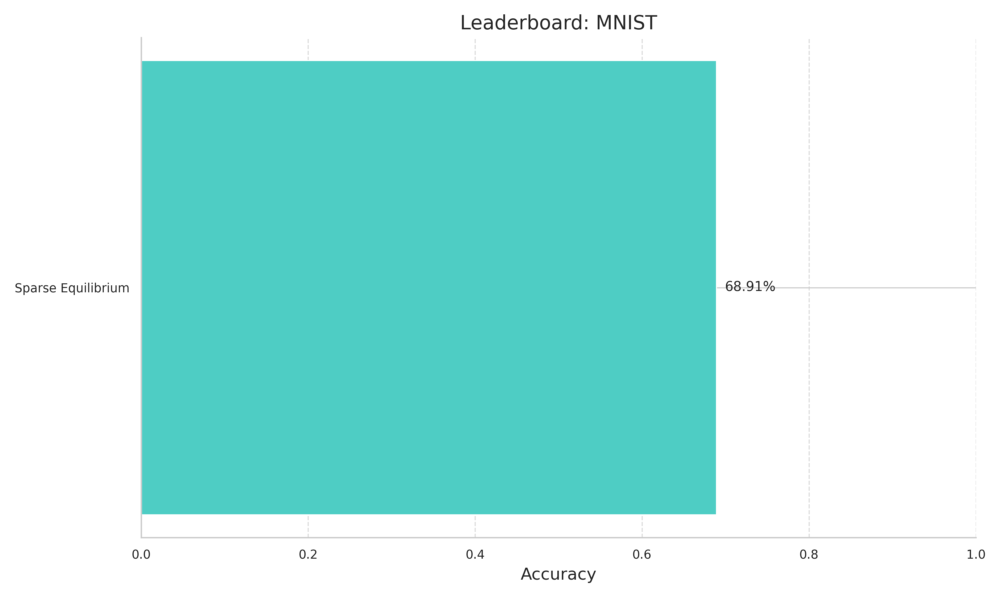
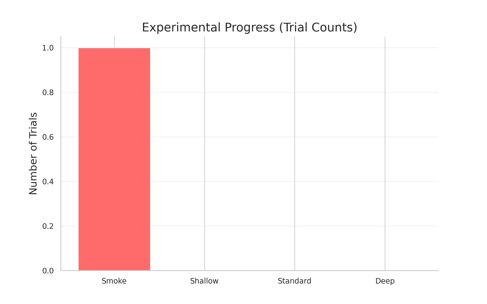
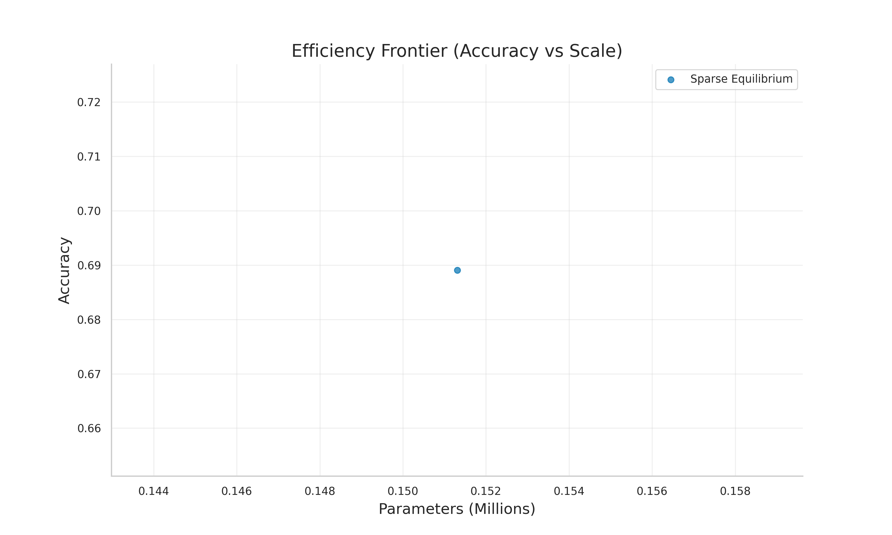
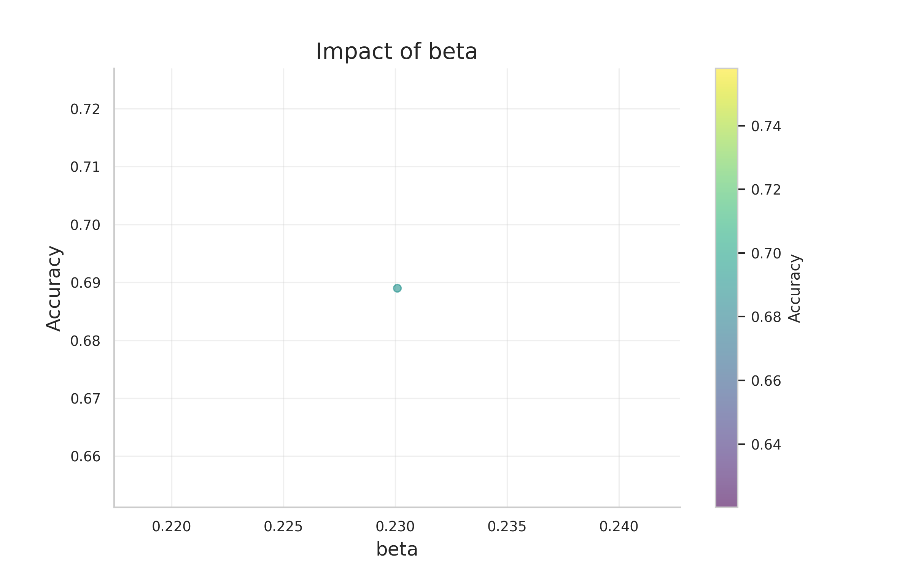

# AutoScientist Discovery Report
**Generated**: 2026-02-04 20:51

## 1. Executive Summary
The autonomous system has conducted **1** experiments.
The current state-of-the-art model discovered is **Sparse Equilibrium** with **68.91%** accuracy.

### Research Narrative
The top performing model is **Sparse Equilibrium**, achieving **68.91%** accuracy.

### Chronicle of Discovery
| Timestamp | Event | Description |
|-----------|-------|-------------|
| 2026-02-04 20:06:57 | **NEW_HYPOTHESIS** | Starting initial investigation (Smoke Test) for Backprop Baseline on tiny_shakespeare. |
| 2026-02-04 20:06:57 | **NEW_HYPOTHESIS** | Starting initial investigation (Smoke Test) for Backprop Baseline on mnist. |
| 2026-02-04 20:06:57 | **NEW_HYPOTHESIS** | Starting initial investigation (Smoke Test) for EqProp MLP on mnist. |
| 2026-02-04 20:06:57 | **NEW_HYPOTHESIS** | Starting initial investigation (Smoke Test) for Holomorphic EqProp on mnist. |
| 2026-02-04 20:06:57 | **NEW_HYPOTHESIS** | Starting initial investigation (Smoke Test) for Directed EqProp (Deep EP) on mnist. |
| 2026-02-04 20:06:57 | **NEW_HYPOTHESIS** | Starting initial investigation (Smoke Test) for Finite-Nudge EqProp on mnist. |
| 2026-02-04 20:06:57 | **NEW_HYPOTHESIS** | Starting initial investigation (Smoke Test) for EqProp Diffusion on mnist. |
| 2026-02-04 20:06:57 | **NEW_HYPOTHESIS** | Starting initial investigation (Smoke Test) for Neural Cube on mnist. |
| 2026-02-04 20:06:57 | **NEW_HYPOTHESIS** | Starting initial investigation (Smoke Test) for Adaptive Feedback Alignment on mnist. |
| 2026-02-04 20:06:57 | **NEW_HYPOTHESIS** | Starting initial investigation (Smoke Test) for Equilibrium Alignment on mnist. |
| 2026-02-04 20:06:57 | **NEW_HYPOTHESIS** | Starting initial investigation (Smoke Test) for Layerwise Equilibrium FA on mnist. |
| 2026-02-04 20:06:57 | **NEW_HYPOTHESIS** | Starting initial investigation (Smoke Test) for Energy Guided FA on mnist. |
| 2026-02-04 20:06:57 | **NEW_HYPOTHESIS** | Starting initial investigation (Smoke Test) for Predictive Coding Hybrid on mnist. |
| 2026-02-04 20:06:57 | **NEW_HYPOTHESIS** | Starting initial investigation (Smoke Test) for Sparse Equilibrium on mnist. |
| 2026-02-04 20:06:57 | **NEW_HYPOTHESIS** | Starting initial investigation (Smoke Test) for Momentum Equilibrium on mnist. |
| 2026-02-04 20:06:57 | **NEW_HYPOTHESIS** | Starting initial investigation (Smoke Test) for Stochastic FA on mnist. |
| 2026-02-04 20:06:57 | **NEW_HYPOTHESIS** | Starting initial investigation (Smoke Test) for Energy Minimizing FA on mnist. |
| 2026-02-04 20:06:57 | **NEW_HYPOTHESIS** | Starting initial investigation (Smoke Test) for DFA (Direct Feedback Alignment) on mnist. |
| 2026-02-04 20:06:57 | **NEW_HYPOTHESIS** | Starting initial investigation (Smoke Test) for CHL (Contrastive Hebbian) on mnist. |
| 2026-02-04 20:06:57 | **NEW_HYPOTHESIS** | Starting initial investigation (Smoke Test) for Deep Hebbian (Hundred-Layer) on mnist. |
| 2026-02-04 20:06:57 | **NEW_HYPOTHESIS** | Starting initial investigation (Smoke Test) for EqProp Transformer (Attention Only) on tiny_shakespeare. |
| 2026-02-04 20:06:57 | **NEW_HYPOTHESIS** | Starting initial investigation (Smoke Test) for EqProp Transformer (Full) on tiny_shakespeare. |
| 2026-02-04 20:06:57 | **NEW_HYPOTHESIS** | Starting initial investigation (Smoke Test) for EqProp Transformer (Hybrid) on tiny_shakespeare. |
| 2026-02-04 20:06:57 | **NEW_HYPOTHESIS** | Starting initial investigation (Smoke Test) for EqProp Transformer (Recurrent) on tiny_shakespeare. |
| 2026-02-04 20:07:33 | **NEW_HYPOTHESIS** | Starting initial investigation (Smoke Test) for Sparse Equilibrium on cartpole. |

### Global Leaderboard
#### Task: MNIST

## 2. Experimental Progress

## 3. Scientific Validity
### Efficiency Frontier

### Statistical Significance (P-Values)

## 4. Machine Learning Analysis
The system trained internal models to understand what makes these algorithms work.
### Global Performance Analysis
A decision tree was trained on the entire dataset to identify which algorithms and tasks drive performance.
## 5. Hyperparameter Correlations

